# 선착순 예약 시스템

특정 시간(00시)에 오픈되는 한정 수량 숙소 상품에 대한 선착순 예약 시스템입니다.

## 시스템 아키텍처

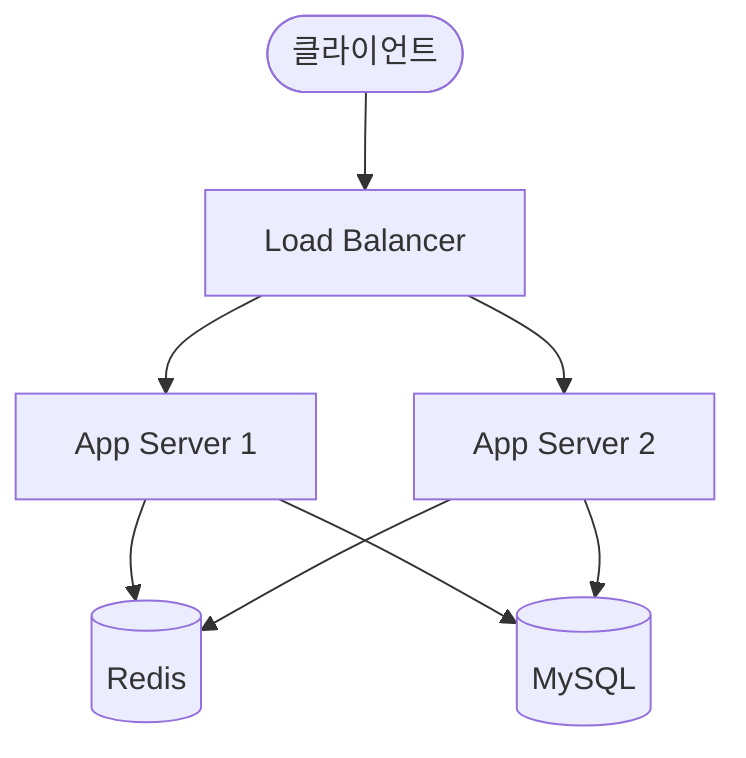

### 컴포넌트 역할

| 컴포넌트       | 역할                                        |
|------------|-------------------------------------------|
| App Server | 예약/결제 비즈니스 로직 처리 (2대 이상 분산 환경)            |
| Redis      | 대기열 관리, 결제 시간 제한 (ready TTL 3분), 멱등성 키 저장 |
| MySQL      | 상품/유저/예약/결제 영구 저장소, 재고 관리 (비관적 락)         |

### 패키지 구조

```
com.hotdeal.reservation
├── booking/          예약 도메인 (Booking, BookingService, Controller)
├── checkout/         주문서 진입 (CheckoutService, Controller)
├── common/           공통 유틸 (EntityUtils, 예외 클래스)
├── idempotency/      멱등성 처리 (AOP, IdempotencyStore)
├── payment/          결제 도메인
│   ├── client/       PG사 클라이언트 (인터페이스 + Mock)
│   └── processor/    결제 수단별 전략 패턴
├── product/          상품 도메인
├── queue/            대기열 관리
│   └── status/       대기열 상태 조회 (폴링)
├── stock/            재고 관리 (DB 비관적 락)
└── user/             사용자 도메인
```

---

## 실행 방법

### 사전 요구사항

- Java 17
- Docker & Docker Compose

### 1. 인프라 실행

```bash
docker compose up -d
```

MySQL(3307 포트)과 Redis(6379 포트)가 실행됩니다.

### 2. 애플리케이션 실행

```bash
./gradlew bootRun --args='--spring.profiles.active=prod'
```

앱 기동 시 자동으로:

- JPA가 테이블을 생성합니다 (`ddl-auto: update`)
- 초기 데이터가 삽입됩니다 (상품 1개, 유저 3명)

### 3. 테스트 실행

```bash
./gradlew test
```

Docker 없이 실행됩니다. H2(인메모리 DB)와 Embedded Redis를 사용합니다.

### 프로파일 구성

| 프로파일         | DB             | Redis          | 용도    |
|--------------|----------------|----------------|-------|
| `local` (기본) | H2 MODE=MySQL  | 비활성화           | 로컬 개발 |
| `prod`       | MySQL (Docker) | Redis (Docker) | 실제 실행 |
| `test`       | H2 MODE=MySQL  | Embedded Redis | 테스트   |

---

## 사용자 흐름

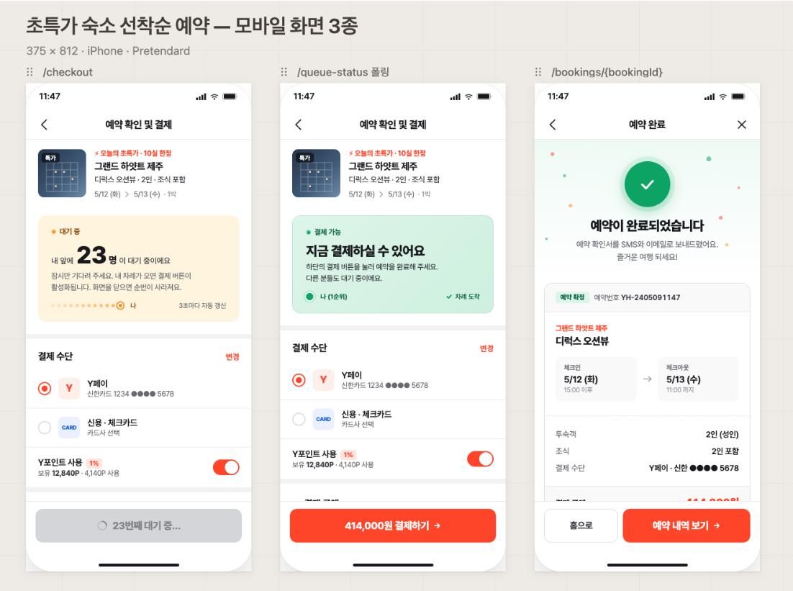

| 화면     | API                   | 설명                        |
|--------|-----------------------|---------------------------|
| 주문서 진입 | `GET /checkout`       | 상품 정보 조회 + 대기열 진입 + 순번 확인 |
| 대기열 폴링 | `GET /queue-status`   | 내 순번 확인, 결제 가능 여부 판단      |
| 예약 완료  | `POST /bookings/{id}` | 결제 처리 + 예약 확정             |

---

## 시퀀스 다이어그램

### 전체 예약 플로우

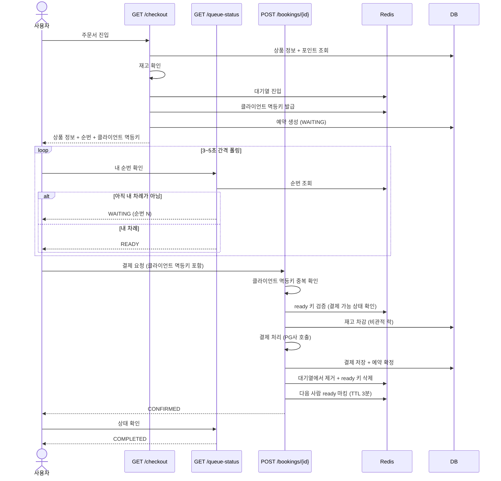

### 복합결제 처리 순서

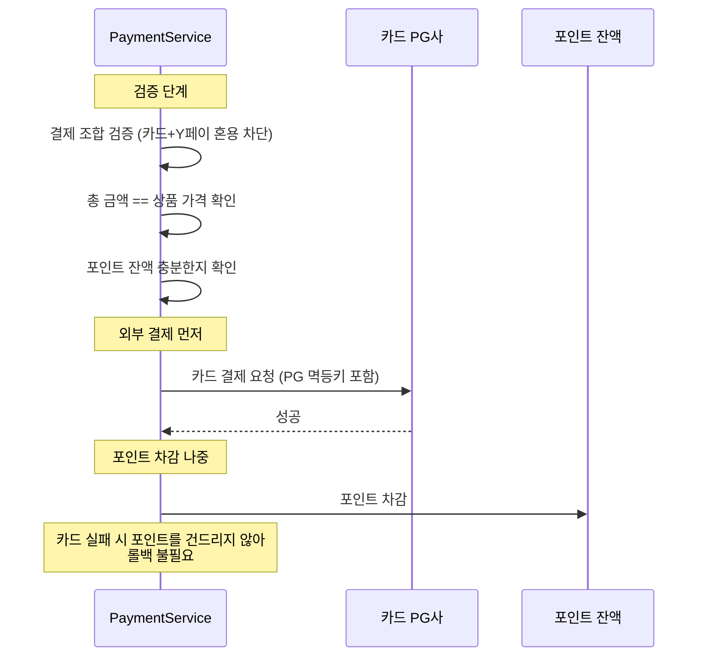

### 동시 요청 시 재고 선점

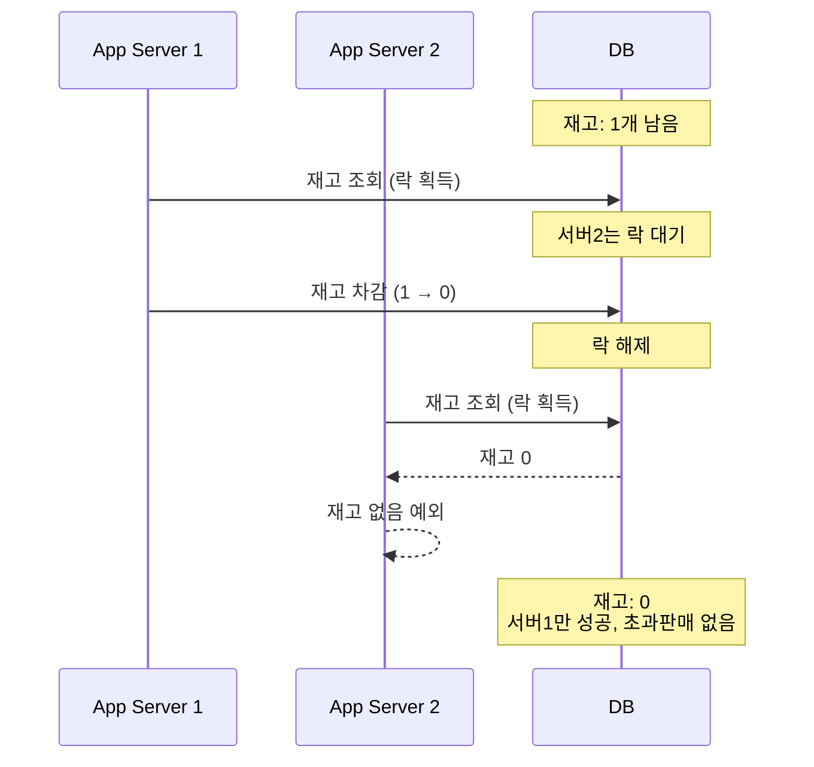

### 결제 실패 시 보상 트랜잭션

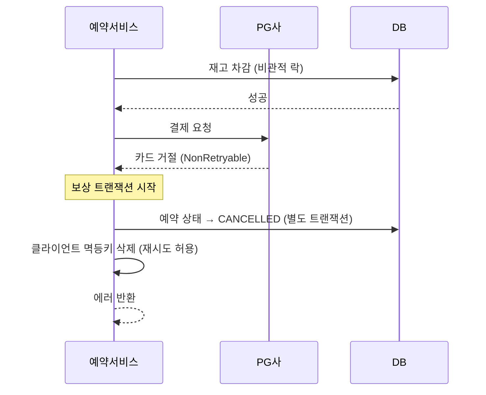

### 결제 재시도 (PG사 일시 장애)

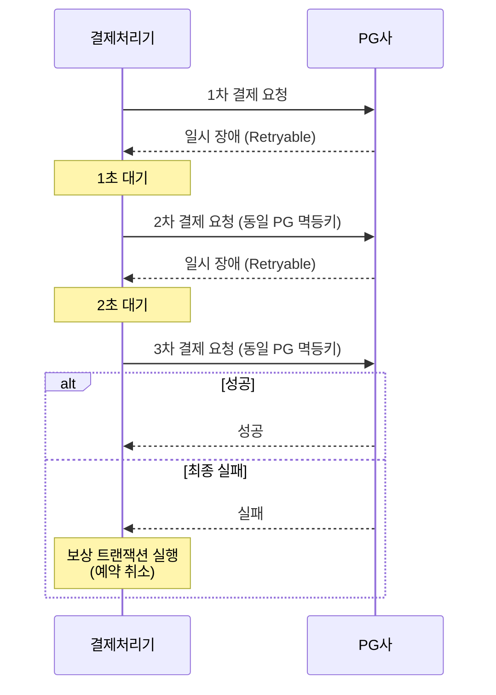

### 대기열 이탈 처리 (ready TTL 만료)

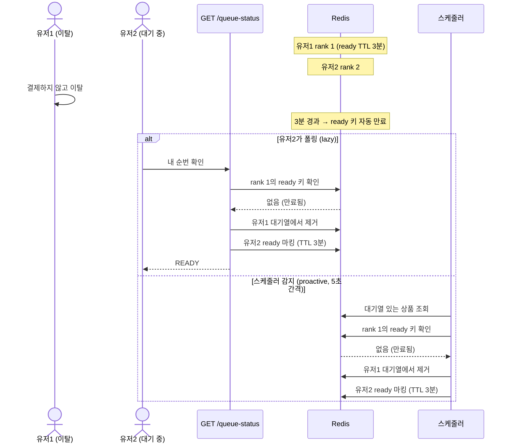

### Redis 장애 시 Checkout

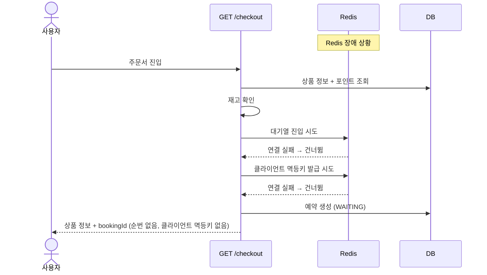

### Redis 장애 시 결제

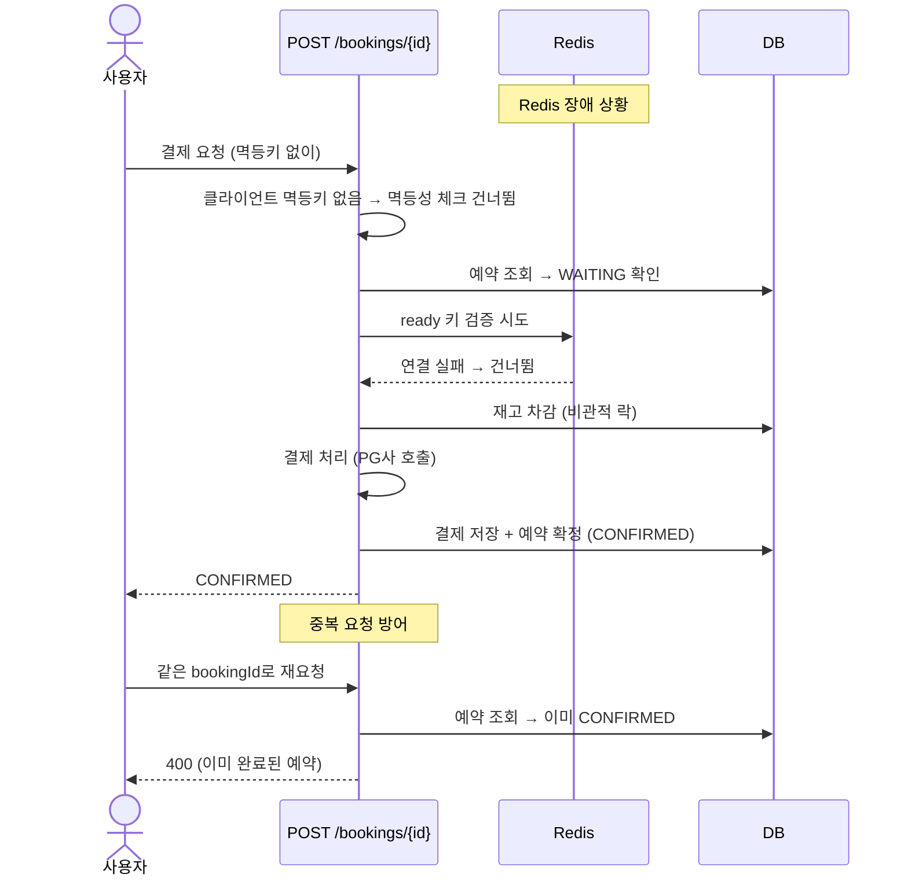

---

## ERD

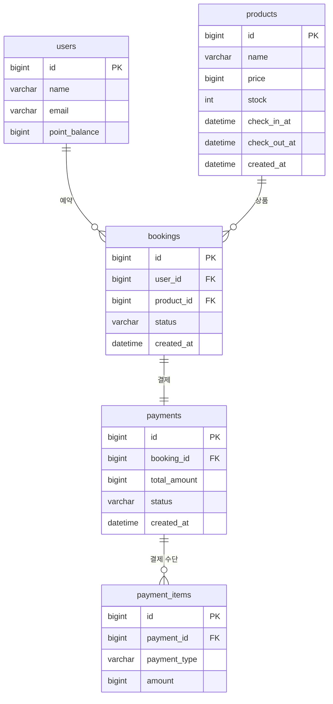

### 테이블 설명

| 테이블             | 설명                                           |
|-----------------|----------------------------------------------|
| `users`         | 사용자 정보. 포인트 잔액 포함                            |
| `products`      | 숙소 상품. 재고(stock)는 DB 비관적 락으로 관리              |
| `bookings`      | 예약 내역. 상태: WAITING → CONFIRMED / CANCELLED   |
| `payments`      | 결제 내역. 상태: PENDING → SUCCESS                 |
| `payment_items` | 복합결제의 각 결제 수단별 금액 (카드 80,000 + 포인트 20,000 등) |

### Redis 키 목록

| 키                                           | 자료구조   | TTL | 용도                               |
|---------------------------------------------|--------|-----|----------------------------------|
| `queue:product:{productId}`                 | List   | 없음  | 대기열 순서 관리                        |
| `queue:entered:{productId}`                 | Set    | 없음  | 중복 진입 방지                         |
| `queue:ready:{productId}:{userId}`          | String | 3분  | rank 1 결제 가능 상태                  |
| `idempotency:{key}`                         | String | 10분 | 클라이언트 멱등키 (PROCESSING → 응답 JSON) |
| `idempotency:checkout:{productId}:{userId}` | String | 10분 | 주문서 진입 시 멱등키 발급 저장               |

---

## API 목록

### GET /checkout

주문서 진입. 상품 정보 조회 + 대기열 진입 + 멱등키 발급.

**Request**

```
GET /checkout?productId=1
Header: userId: 1
```

**Response (200)**

```json
{
  "bookingId": 1,
  "idempotencyKey": "uuid-abc-123",
  "productName": "제주 초특가 호텔",
  "price": 100000,
  "checkInAt": "2026-06-01T15:00:00",
  "checkOutAt": "2026-06-02T11:00:00",
  "pointBalance": 50000,
  "rank": 1
}
```

| 상태 코드 | 설명              |
|-------|-----------------|
| 200   | 정상              |
| 400   | 재고 없음           |
| 404   | 상품/사용자 없음       |
| 409   | 이미 대기열에 진입한 사용자 |

---

### GET /queue-status

대기열 상태 조회. 3~5초 간격으로 폴링.

**Request**

```
GET /queue-status?productId=1
Header: userId: 1
```

**Response (200)**

```json
{
  "status": "WAITING",
  "rank": 5
}
{
  "status": "READY",
  "rank": 1
}
{
  "status": "COMPLETED",
  "rank": null
}
```

| 상태 코드 | 설명                               |
|-------|----------------------------------|
| 200   | 정상 (WAITING / READY / COMPLETED) |
| 400   | 재고 없음 (재진입 불가)                   |
| 404   | 대기열에 없는 사용자                      |
| 503   | Redis 장애로 조회 불가                  |

---

### POST /bookings/{bookingId}

결제 및 예약 완료.

**Request**

```
POST /bookings/1
Header: userId: 1
Header: Idempotency-Key: uuid-abc-123
Content-Type: application/json

{
  "productId": 1,
  "paymentMethods": [
    { "type": "CREDIT_CARD", "amount": 80000 },
    { "type": "YPOINT", "amount": 20000 }
  ]
}
```

**Response (200)**

```json
{
  "bookingId": 1,
  "status": "CONFIRMED"
}
```

| 상태 코드 | 설명                                                 |
|-------|----------------------------------------------------|
| 200   | 결제 성공                                              |
| 400   | 결제 검증 실패 (혼용, 금액 불일치, 포인트 부족, 재고 없음, 순번 아님, 이미 완료) |
| 404   | 예약 없음                                              |
| 409   | 처리 중 (멱등키 충돌)                                      |
| 500   | PG사 장애 (재시도 모두 실패)                                 |

**지원 결제 수단**

| 결제 수단         | 설명              |
|---------------|-----------------|
| `CREDIT_CARD` | 신용카드 (PG사 호출)   |
| `YPAY`        | Y페이 (PG사 호출)    |
| `YPOINT`      | Y포인트 (내부 잔액 차감) |

**복합결제 규칙**

- 카드 + 포인트 ✅
- Y페이 + 포인트 ✅
- 카드 + Y페이 ❌ (혼용 불가)